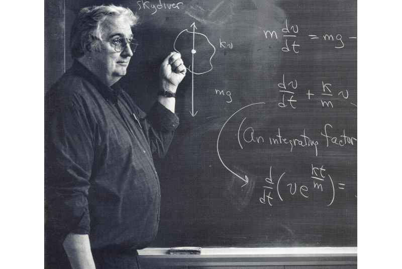
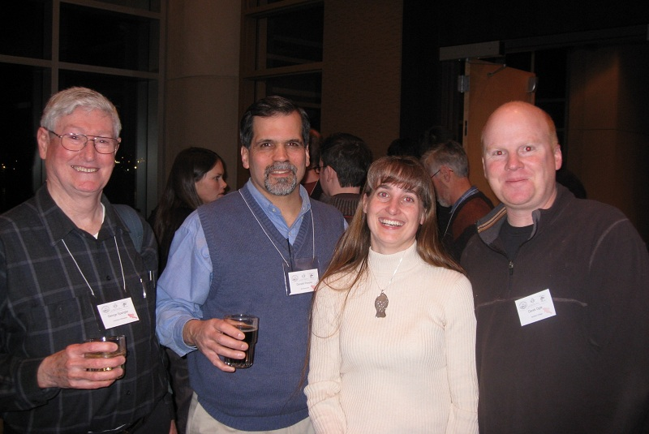

## Dedication

I have been fortunate enough to have had three significant mentors during my career.

* **Nicholas Bystrom** was [my basketball coach](http://www.northlandcollegesports.com/hof.aspx?hof=48&path=&kiosk=) and statistics and mathematics professor at [Northland College](http://www.northland.edu/).  "Coach" helped me understand, very early in my career, the power, utility, and beauty of mathematics and statistics.
* **James Selgeby** was my boss for a work-study position with the U.S. Fish and Wildlife Service during my last two years at [Northland College](http://www.northland.edu/).  Jim trusted me as a fisheries scientist, fostered my passion for Great Lakes fisheries, and encouraged me to pursue an advanced degree in fisheries.
* **George Spangler** was my doctoral advisor at the University of Minnesota.  George strongly encouraged advanced studies in statistics, supported my interest in programming, and provided an environment, as a graduate student and later while on sabbatical, where I could creatively mix statistics, programming, and fisheries.

This book would not exist without each of these great men.  I dedicate this work to them.

  <!-- Indicators -->
  <ol class="carousel-indicators">
    <li data-target="#mentorCarousel" data-slide-to="0" class="active"></li>
    <li data-target="#mentorCarousel" data-slide-to="1"></li>
    <li data-target="#mentorCarousel" data-slide-to="2"></li>
    <li data-target="#mentorCarousel" data-slide-to="3"></li>
    <li data-target="#mentorCarousel" data-slide-to="4"></li>
    <li data-target="#mentorCarousel" data-slide-to="5"></li>
    <li data-target="#mentorCarousel" data-slide-to="6"></li>
  </ol>

  <!-- Wrapper for slides -->
  

    

      
      

Nick at the board, Northland College ca. 1995.

    

    

      
      

Derek and Jim following Jim's honorary degree reception at Northland College, 2007.

    

    

      
      

Derek and George, December, 2015.

    

    

      
      

Nick coaching basketball, Northland College ca. 1986.

    

    

      
      

Jim at his desk, ca. 1990.

    

    

      
      

George, Don Pereira, Shannon Davis-Foust, and Derek at the national AFS meeting in Minneapolis, 2012.

    

    

      
      

George sailing on Lake Pepin, ca. 2008.

    

  

  

