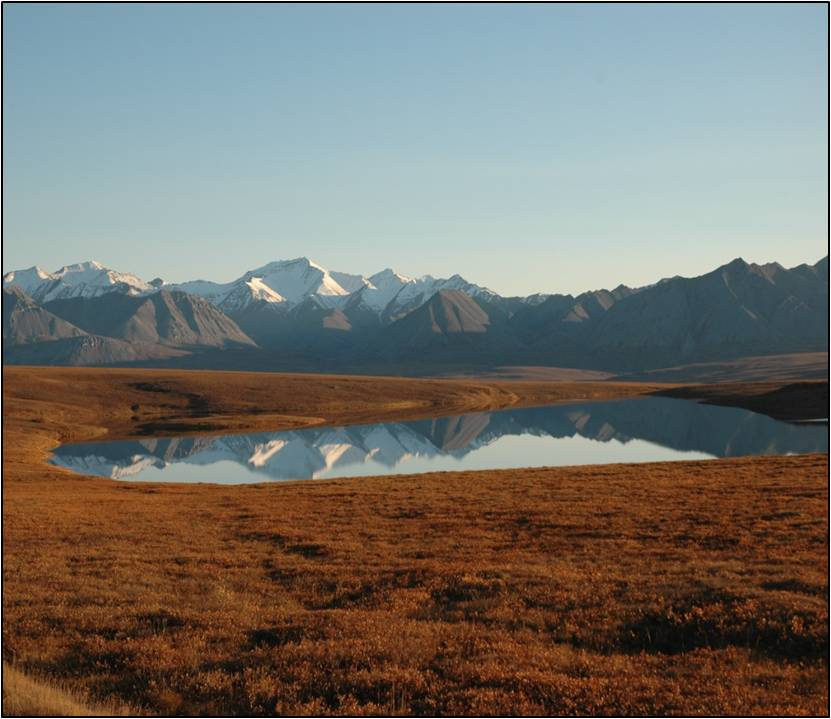

```{r echo=FALSE,eval=-2}
source("../rhelpers/IFARhelpers.R")
modHTML("AKSlimySculpins_Growth_B",need2render=FALSE)
```


The total length (mm) and otolith age of [Slimy Sculpin](https://en.wikipedia.org/wiki/Slimy_sculpin) (*Cottus cognatus*) captured in the [Arctic Long-Term Ecological Research](http://ecosystems.mbl.edu/ARC/) area were recorded in `r addDataLinks("SculpinALTER")`.

Use these data, and results from [this exercise](AKSlimySculpins_Growth_A.html), to answer the following questions.

1. Fit von Bertalanffy's original parameterization.  [**Hint:** See `vbModels()` and [this supplement](../supplements/growth/OtherVBGFParams.html).]
    1. Plot TL versus age and superimpose the best-fit VBGF.  Comment on model fit.
    1. Construct a residual plot.  Comment on model fit.
    1. Write the equation for the "original" VBGF with parameters replaced by their estimated values.
    1. Carefully interpret the meaning of each parameter?
    1. How does the estimate of $L_{\infty}$ and $K$ from fitting this parameterization compare to that from the typical VBGF fit in [this exercise](AKSlimySculpins_Growth_A.html).  Explain your observation.
    1. Predict the mean TL, with 95% confidence interval, for an age-3 Slimy Sculpin.  How does this prediction compare to the prediction you made using the typical VBGF in [this exercise](AKSlimySculpins_Growth_A.html)?

---
```{r echo=FALSE, results="asis"}
exercise_footer("AKSlimySculpins_Growth_B")
```
