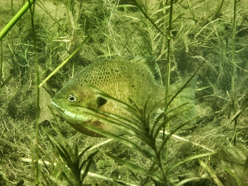

```{r echo=FALSE, eval=FALSE}
# Renders an appropriate HTML file for the webpage
setwd("C:/aaaWork/Web/GitHub/IFAR/exercises"); source("../rhelpers/IFARhelpers.R")
fnm <-"Inch_ConditionBluegill"; modHTML(fnm)
```


[Inch Lake](http://dnr.wi.gov/lakes/lakepages/LakeDetail.aspx?wbic=2764300&page=facts) is a 12.5 ha inland lake in northern Wisconsin that has been managed as catch-and-release for all species since 2006.  Researchers at Northland College have monitored fish populations in Inch Lake since 2007.  The total lengths (inches) and weights (g) for subsamples of several species of fish collected from Inch Lake in May of 2007 and 2008 are recorded in [this CSV file](data/InchLake2.csv) (these data are also available in `InchLake2` from `FSAdata`).

1. Complete [this Data Manipulation exercise](Inch_DataManip.html) to create a Bluegill only data.frame.
1. Further prepare the data.frame for computation of relative weights (i.e., add a variable of relative weights and filter the data.frame to only those lengths for which the relative weights should be computed).
1. Create a data.frame of Bluegills captured only in 2007.
    1. Compute the mean relative weight for each Gabelhouse length category.
    1. Determine if the mean relative weight differs among Gabelhouse length categories.
    1. Construct a plot, with confidence intervals and appropriate significance letters, that depict your results.
1. Repeat the above for Bluegills captured only in 2008.
1. [*Extension*] Empirically compare your results between years.  Provide at least three observations from your findings and at least two plausible explanations for what you observed.

---
```{r echo=FALSE, results="asis"}
exercise_footer(fnm)
```
