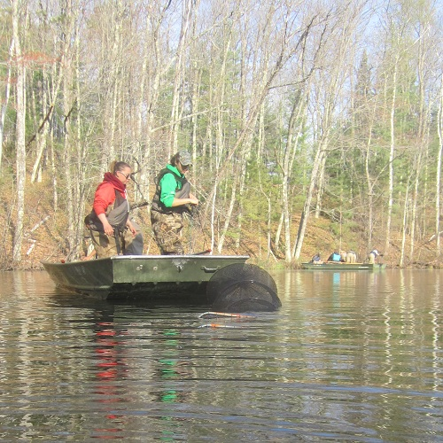

```{r echo=FALSE}
source("../rhelpers/IFARhelpers.R")
```


[Inch Lake](http://dnr.wi.gov/lakes/lakepages/LakeDetail.aspx?wbic=2764300&page=facts) is a 12.5 ha inland lake in northern Wisconsin that has been managed as catch-and-release for all species since 2006.  Researchers at [Northland College](http://www.northland.edu/) have monitored fish populations in Inch Lake since 2007.  The total lengths (inches) and weights (g) for subsamples of several species of fish collected from Inch Lake in May of 2007 and 2008 are recorded in `r addDataLinks("InchLake2")`.  Use these data to answer the following questions.

1. Create a new variable that contains lengths in millimeters.
1. Create a new data.frame of just [Bluegill](https://en.wikipedia.org/wiki/Bluegill).
1. Create a new data.frame of just [Largemouth Bass](https://en.wikipedia.org/wiki/Largemouth_bass).
1. Create a new data.frame of nongame species ([Bluntnose Minnow](https://en.wikipedia.org/wiki/Bluntnose_minnow), [Fathead Minnow](https://en.wikipedia.org/wiki/Fathead_minnow), [Iowa Darter](https://en.wikipedia.org/wiki/Iowa_darter), and [Tadpole Madtom](https://en.wikipedia.org/wiki/Tadpole_madtom)).
1. Remove the `netID` variable from the two single species data.frames created above.
1. Sort the nongame species only data.frame by species.
1. Sort the nongame species only data.frame by length within species within year.
1. Change the names of the `weight` variable to `wt` and the length in millimeters variable to `tl` (if you did not call it that above).
1. Create two new variables that are the [common logarithms](https://en.wikipedia.org/wiki/Common_logarithm) of the lengths (in mm) and weights.
1. Add appropriate five-cell Gabelhouse length categories to the Bluegill and Largemouth Bass only data.frames.

Save the script from this exercise as these data will be used in [this plotting](Inch_Plotting.html), these weight-length relationhip ([A](Inch_WLBluegill_A.html) and [B](Inch_WLLargemouthBass_A.html)), and these condition ([A](Inch_ConditionBluegill.html) and [B](Inch_ConditionLargemouthBass.html)) exercises.

---
```{r echo=FALSE, results="asis"}
exercise_footer("Inch_DataManip")
```
