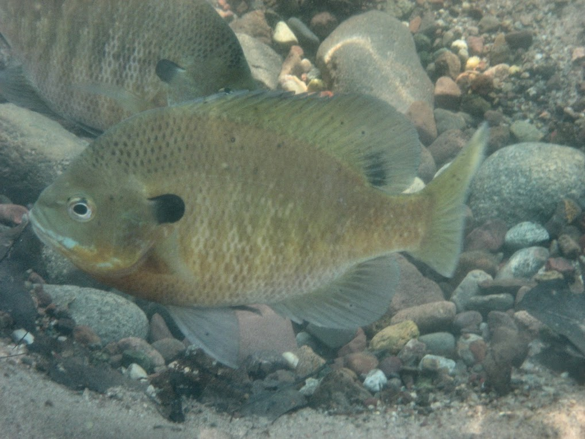

```{r echo=FALSE, eval=FALSE}
# Renders an appropriate HTML file for the webpage
setwd("C:/aaaWork/Web/GitHub/IFAR/exercises"); source("../rhelpers/IFARhelpers.R")
fnm <-"Inch_WLBluegill_B"; modHTML(fnm)
```


[Inch Lake](http://dnr.wi.gov/lakes/lakepages/LakeDetail.aspx?wbic=2764300&page=facts) is a 12.5 ha inland lake in northern Wisconsin that has been managed as catch-and-release for all species since 2006.  Researchers at [Northland College](http://www.northland.edu/) have monitored fish populations in Inch Lake since 2007.  The total lengths (inches) and weights (g) for subsamples of several species of fish collected from Inch Lake in May of 2007 and 2008 are recorded in [this CSV file](data/InchLake2.csv) (these data are also available in `InchLake2` from `FSAdata`).

Load these data, isolate [Bluegill](https://en.wikipedia.org/wiki/Bluegill), and answer the following questions.  [Note that this is a continuation of [this exercise](Inch_WLBluegill_A.html).]

1. Complete [this Plotting exercise](Inch_Plotting.html).  Qualitatively assess if the weight-length (in mm here and throughout) relationship differs between the two years.
1. Determine if there is a statistically signficant difference in the weight-length relationship between the two years.  Provide evidence for your findings and carefully interpret the final result.
1. Use the results from above (and without fitting separate regressions for the two sample years) to express the weight-length relationships on the raw scale for both years.
1. Construct a plot that illustrates your findings.

Continue with this data set for [this condition exercise](Inch_ConditionBluegill.html).

---
```{r echo=FALSE, results="asis"}
exercise_footer(fnm)
```
