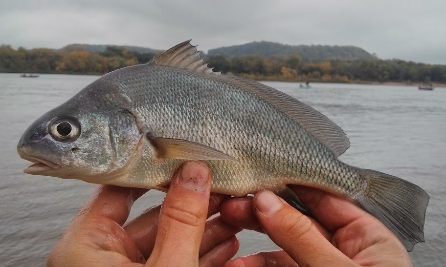

```{r echo=FALSE}
source("../rhelpers/IFARhelpers.R")
```


[Bur (1984)](http://www.sciencedirect.com/science/article/pii/S0380133084718065) examined the population dynamics of [Freshwater Drum](https://en.wikipedia.org/wiki/Freshwater_drum) (*Aplodinotus grunniens*) in  [Lake Erie](https://en.wikipedia.org/wiki/Lake_Erie) in the late 1970s.  In one part of his study, he measured the total length (TL) of all 1577 drum sampled and extracted [scales](https://en.wikipedia.org/wiki/Fish_scale) for age estimation from a proportionate sample from each 10 mm length interval.  The length and age data are recorded in `r addDataLinks("FWDrumLE2")`.

1. Separate the observed data into age- and length-samples.  How many fish are in each sample?
1. Add a variable to the age-sample that contains the 10 mm TL categories.  Construct a table of the **number** (not proportion) of fish in each age and 10 mm TL category in the age-sample.  From these results, compute each of the following *by hand* (i.e., not using R).
    1. How many Freshwater Drum in the age-sample are in the 230 mm TL category?
    1. How many age-5 Freshwater Drum are in the age-sample?
    1. What proportion of Freshwater Drum in the 300 mm TL category are age 5?
    1. What proportion of Freshwater Drum in the 200 mm TL category are age 4?
1. Construct an **observed** age-length key from the table above (using R).  From these results answer the following questions.
    1. What proportion of Freshwater Drum in the 210 mm TL category should be assigned age 5?
    1. How many of thirty Rock Bass in the 250 mm TL category should be assigned age 4?
    1. Construct a plot of the **observed** age-length key.  Are there any potential anomalies in the plot that would suggest that a smoothed age-length key could be appropriate?
1. Construct a **smoothed** age-length key.  From these results answer the following questions.
    1. What proportion of Freshwater Drum in the 210 mm TL category should be assigned age 5?
    1. How many of thirty Rock Bass in the 250 mm TL category should be assigned age 4?

[Continue with these data here](LEFWDrum_ALK_B.html).

---
```{r echo=FALSE, results="asis"}
exercise_footer("LEFWDrum_ALK_A")
```
