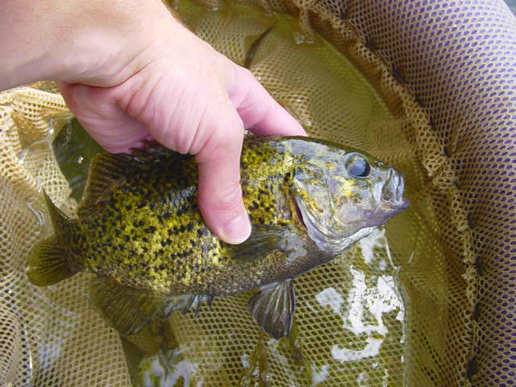

```{r echo=FALSE}
source("../rhelpers/IFARhelpers.R")
```


[Wolfert (1980)](https://pubs.er.usgs.gov/publication/1000461) measured the total length (TL) of 1288 [Rock Bass](https://en.wikipedia.org/wiki/Rock_bass) (*Ambloplites rupestris*) from Eastern [Lake Ontario](https://en.wikipedia.org/wiki/Lake_Ontario) in the late 1970s.  In addition, scales were removed for age estimation from as many as 10 specimens from each 10 mm length interval.  All data are recorded in `r addDataLinks("RockBassLO2")`. [*Note that the filename contains an "oh" not a "zero."*].

1. Separate the observed data into age- and length-samples.  Construct an **observed** age-length key.  [This step would have been accomplished in [this exercise](LORockBass_ALK_A.html).]
1. Use the semi-random age assignment technique from Isermann and Knight (2005) and the **observed** age-length key to assign ages to the unaged fish in the length-sample.  Combine the age-sample and the age-assigned length-sample into a single data frame, add a variable to this data.frame that contains the 10 mm TL categories, and use the combined data frame to answer the following questions.
    1. How many fish are estimated to be age 5?  [Hint: use `xtabs()` or `Summarize()`.]
    1. How many fish are estimated to be age 11?
    1. Plot the age distribution for all fish.
    1. How many fish are in the 150 mm TL interval? [Hint: use `xtabs()`.]
    1. What is the mean TL of age-5 fish?
    1. Plot the length-at-age with the mean length-at-age superimposed for all fish.
    1. Compare your results to someone else's results (or repeat the steps above).  Did you both get the *exact* same results? Why or why not?  If not, how different were they?

Continue with these data in [a growth exercise](LORockBass_Growth_A.html).

---
```{r echo=FALSE, results="asis"}
exercise_footer("LORockBass_ALK_B")
```
