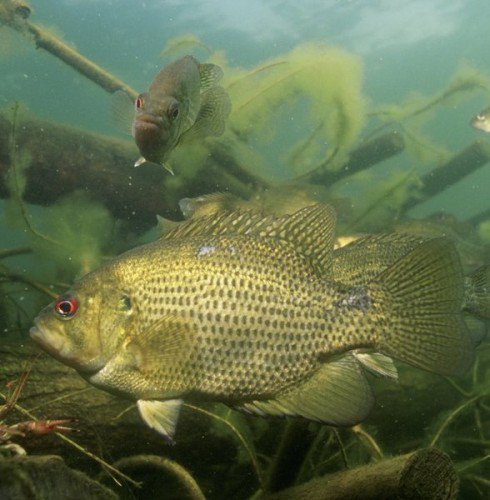

```{r echo=FALSE,eval=-5}
## knit HTML from RStudio first
setwd("C:/aaaWork/Web/GitHub/IFAR/exercises")
source("../rhelpers/IFARhelpers.R")
fnm <- "LORockBass_Growth_A"
modHTML(fnm,need2render=FALSE)
```


[Wolfert (1980)](https://pubs.er.usgs.gov/publication/1000461) measured the total length (TL) of 1288 [Rock Bass](https://en.wikipedia.org/wiki/Rock_bass) (*Ambloplites rupestris*) from Eastern [Lake Ontario](https://en.wikipedia.org/wiki/Lake_Ontario) in the late 1970s.  In addition, [scales](https://en.wikipedia.org/wiki/Fish_scale) were removed for age estimation from as many as 10 specimens from each 10 mm length interval.  All data are recorded in `r addDataLinks("RockBassLO2")`. [*Note that the filename contains an "oh" not a "zero."*].

In this [age-length key exercise](LORockBass_ALK_B.html), a data.frame was produced that had age assignments for all 1288 fish.  Use that data.frame to answer the questions below (i.e., open and run your script from that exercise and then continue with an analysis for the questions below.)

1. Examine the plot of TL versus age.  Observe the "shape" of the data (do the results look linear or like a von Bertalanffy growth curve, is there an obvious asymptote, are young fish well represented, how variable are lengths within ages).
1. Fit the typical parameterization of the von Bertalanffy growth function (VBGF).
    1. How realistic do the point estimates of $L_{\infty}$, $K$, and $t_{0}$ seem?
    1. Write the typical VBGF with parameters replaced by their estimated values.
    1. Carefully interpret the meaning of each parameter.
    1. Construct 95% bootstrapped confidence intervals for each parameter.  Comment on the widths of these confidence intervals.  What explains this?
    1. Predict the mean TL, with 95% confidence interval, for an age-6 Rock Bass.  Comment on the width of this confidence interval.  What explains this?
    1. Plot TL versus age and superimpose the best-fit VBGF.  Comment on model fit.
    1. Construct a residual plot.  Comment on model fit.
    1. Compute the correlation between parameter values.  Comment.

[Continue with this data set here](LORockBass_Growth_B.html).

---
```{r echo=FALSE, results="asis"}
exercise_footer(fnm)
```
