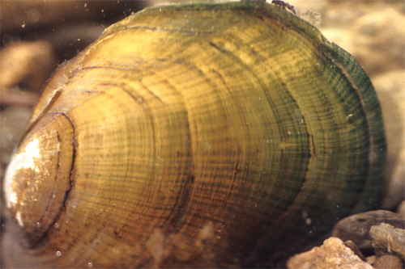

```{r echo=FALSE, eval=FALSE}
# Renders an appropriate HTML file for the webpage
setwd("C:/aaaWork/Web/GitHub/IFAR/exercises"); source("../rhelpers/IFARhelpers.R")
fnm <-"MarkRecap_TanRiffleshell"; modHTML(fnm)
```


[Rogers (1999)](http://scholar.lib.vt.edu/theses/available/etd-121499-145732/unrestricted/etd.pdf) studied the endangered freshwater mussel [Tan Riffleshell](http://ecos.fws.gov/speciesProfile/profile/speciesProfile.action?spcode=F010) (*Epioblasma florentina walkeri*) in Indian Creek, Virginia.  Part of the study included a detailed analysis of the population dynamics of mussels in a 100 m stretch of stream.  In this stream, mussels were captured by teams of snorkelers on six occasions (June 1996; August 1996; June 1997; October 1998; May 1999; and June 1999).  Mussels were tagged by attaching a numbered tag to the left valve of the mussel.  The number of mussels captured, the number of marked mussels observed, and the number of tagged mussels returned to the population were recorded for each sample time.  These data are in `Riffleshell` in the `FSAdata` package.  Use this information to answer the following questions.

1. Estimate the number, with 95% confidence interval, of Tan Riffleshell mussels in the population at the beginning of the study.  Carefully interpret the result.
1. Comment on the validity of the assumptions for the model you used to estimate the size of the population.

---
```{r echo=FALSE, results="asis"}
exercise_footer(fnm)
```
