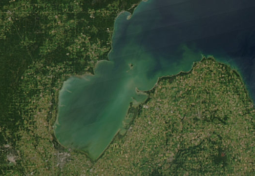

```{r echo=FALSE}
source("../rhelpers/IFARhelpers.R")
```



[Diana and Salz (1990)](http://www.tandfonline.com/doi/abs/10.1577/1548-8659%281990%29119%3C0976%3AESGAMO%3E2.3.CO%3B2) examined the growth and maturity of [Yellow Perch](https://en.wikipedia.org/wiki/Yellow_perch) captured from  multiple sites at two locations (`inner` and `outer`) within [Saginaw Bay](https://en.wikipedia.org/wiki/Saginaw_Bay), [Lake Huron](https://en.wikipedia.org/wiki/Lake_Huron) (MI) from 1983-1985.  The primary goal of this research was to determine if the growth and maturation of Yellow Perch showed evidence of stunting.  The total lengths and location of capture for this study are in `r addDataLinks("YPerchSB1")`.  Use these data to answer the following questions.

1. Isolate the Yellow Perch captured from the `inner` portion of Saginaw Bay.
    1. Describe the distribution of these fish using both a histogram and frequency table.
    1. Compute and interpret the $PSD-Q$ value (with 95% confidence interval).
    1. Compute and interpret the $PSD-P$ value (with 95% confidence interval).
    
1. Isolate the Yellow Perch captured from the `outer` portion of Saginaw Bay.
    1. Describe the distribution of these fish using both a histogram and frequency table.
    1. Compute and interpret the $PSD-Q$ value (with 95% confidence interval).
    1. Compute and interpret the $PSD-P$ value (with 95% confidence interval).

1. Statistically compare the following metrics between Yellow Perch captured in the the `inner` and `outer` portions of Saginaw Bay.
    1. Length frequency distribution.
    1. Distributions into the five-cell Gabelhouse length categories.
    1. $PSD-Q$.
    1. $PSD-P$.

---
```{r echo=FALSE, results="asis"}
exercise_footer("SizeStrux_SaginawYP")
```
