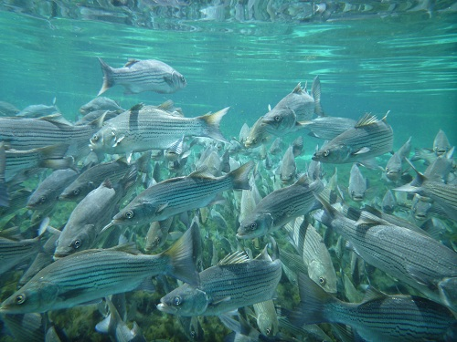

```{r echo=FALSE}
source("../rhelpers/IFARhelpers.R")
```


Researchers at the [Center for Quantitative Fisheries Ecology at Old Dominion University](http://www.odu.edu/sci/research/cqfe/research/ageing-lab) in collaboration with the [Virginia Marine Resources Commission](http://www.mrc.virginia.gov/) annually collect [Stiped Bass](https://en.wikipedia.org/wiki/Striped_bass) (*Morone saxatilis*) from Virginia waters of the Atlantic Ocean for age assessments.  The total lengths of 1201 Stiped Bass collected in 2003 and the ages estimated from [otoliths](https://en.wikipedia.org/wiki/Otolith) for as many as 10 fish per 1 inch length interval are recorded in `r addDataLinks("StripedBass3")`

1. Separate the observed data into age- and length-samples.  Construct an **observed** age-length key.  [This step would have been accomplished in [this exercise](StripedBass_ALK_A.html).]
1. Use the semi-random age assignment technique from Isermann and Knight (2005) and the **observed** age-length key to assign ages to the unaged fish in the length-sample.  Combine the age-sample and the age-assigned length-sample into a single data frame, add a variable to this data.frame that contains the 1 inch TL categories, and use the combined data frame to answer the following questions.
    1. How many fish are estimated to be age 8?
    1. How many fish are estimated to be age 14?
    1. Plot the age distribution for all fish.
    1. How many fish are in the 30 in TL interval?
    1. What is the mean TL of age-9 fish?
    1. Plot the length-at-age with the mean length-at-age superimposed for all fish.
1. Compare your results from the previous question to someone else's results (or repeat the previous question).  Did you both get the *exact* same results? Why or why not?  If not, how different were they?

[Continue with these data here](StripedBass_ALK_C.html).  These data also used in [this growth exercise](StripedBass_Growth_A.html).

---
```{r echo=FALSE, results="asis"}
exercise_footer("StripedBass_ALK_B")
```
