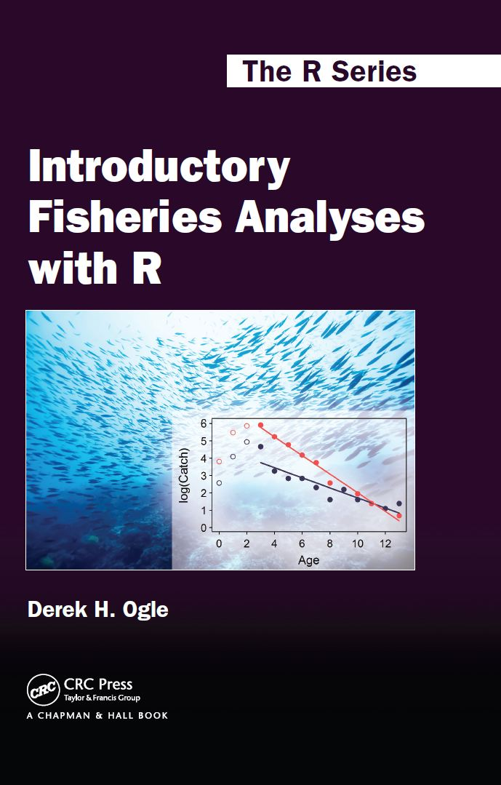

This website provides support materials for the <strong>Introductory Fisheries Analysis with R</strong> book by <a href="http://derekogle.com">Derek H. Ogle</a>.  Access materials through the menu in the upper-right corner.

See related materials on the <strong><a href="http://derekogle.com/fishR/">fishR</a></strong> website.

<a href="mailto:fishr@derekogle.com?subject=IFAR%20Question%20or%20Comment">Contact the author</a> with any comments, questions, or suggestions.

