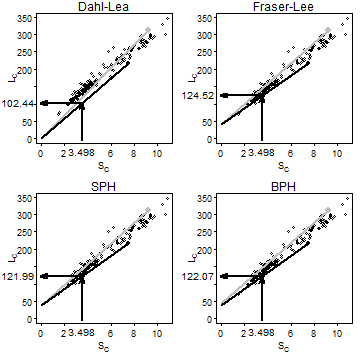

@Francis1990 defined *back-calculation* as "... a technique that uses a set of measurements made on a fish at one time to infer its length at an earlier time or times.  Specifically, the dimensions of one or more marks in some hard part of the fish, together with its current body length, are used to estimate its length at the time of formation of each of the marks. ... The marks are generally annual rings associated with growth checks, ... ."  Thus, backcalculation is the reconstruction of the length of a fish at previous ages from measurements made on calcified structures.

### Required Packages for this Supplement
Functions used in this supplement require the packages shown below.


## Registering fonts with R



> library(FSA)
> library(magrittr)
> library(dplyr)
> library(tidyr)
> library(stringr)


### Data Used in this Supplement
All analyses in this supplement use the West Bearskin Lake Smallmouth Bass (*Micropterus dolomieu*) data from @Weisberg1993 in `SMBassWB` of `FSA`.  The analysis in this supplement will focus on those fish captured in 1990.  Three variables that were constant and not used in this analysis and three measurement variables that corresponded to ages that did not exist after reducing to only 1990 were removed to save space.


> data(SMBassWB)
> wb90 <- filterD(SMBassWB,yearcap==1990) %>%
    select(-(species:gear),-(anu10:anu12))


## Background
### Terminology
Two types of measurements can be made on calcified structures.  A *radial* measurement is the total distance from the center of the structure (e.g., focus of scale or nucleus of otolith) to the anterior edge of an annulus.  An *incremental* measurement is the distance between two successive annuli.  Radial measurements are required for back-calculation of fish length.

Back-calculation models estimate length at previous age $i$ (i.e., $L_{i}$) from known values of length at time of capture ($L_{C}$), scale radius to the $i$th annulus ($S_{i}$), and scale radius at time of capture ($S_{C}$).  Several back-calculation models rely on the relationship between $S_{C}$ and $L_{C}$.  Depending on the model, a function of mean $S_{C}$ for a given $L_{C}$ (i.e., $E(S_{C}|L_{C})$ ) or mean $L_{C}$ for a given $S_{C}$ (i.e., $E(L_{C}|S_{C})$) is used.  These functions are not required to be linear, but often are, and in their linear form are represented as

$$ E(S_{C}|L_{C})=a+bL_{C} \quad \quad \text{(1)} $$

$$ E(L_{C}|S_{C})=c+dS_{C} \quad \quad \text{(2)} $$

\noindent Fitting these regressions is demonstrated below.

### Common Back-Calculation Models
The first back-calculation model was jointly developed by Knut Dahl and Einar Lea and appeared in @Lea1910.  The underlying concept of the *Dahl-Lea model* is that growth of the calcified structure is in exact proportion to growth in length of the fish.  With this, the ratio of $S_{i}$ to $S_{C}$ is the same as the ratio of $L_{i}$ to $L_{C}$.  Rearrangement of this equality yields the Dahl-Lea back-calculation model

$$ L_{i}=\frac{S_{i}}{S_{C}}L_{C} \quad \quad \text{(3)} $$

The Dahl-Lea model describes a family of straight lines that pass through the **origin** and each observed ($S_{C},L_{C}$) point.  Visually (Figure  1), the estimated $L_{i}$ for a particular fish is found by locating $S_{i}$ along the x-axis, moving vertically until the straight line for that fish is met, and then moving horizontally to the point on the y-axis.

 

Figure  1: Plot of length-at-capture versus scale radius for West Bearskin Lake Smallmouth Bass in 1990.  All four methods of backcalculation are shown for fish 704 ($S_{2}=3.49804$, $L_{C}=218$, and $S_{C}=7.44389$; black point and line) with calculational steps shown with the arrows.  Fish 701 is shown as the gray point and line for comparative purposes.

@Fraser1916 was the first to describe, but @Lee1920 was the first to formally derive, the back-calculation model from the concept that ``the growth *increment* of the scale is, on the average ..., a constant proportion of the growth *increment* of the fish" (@Francis1990).  In practice, the *Fraser-Lee model* modified the Dahl-Lea model by adjusting for the length of the fish when the calcified structure forms (i.e., $L=c$ when $S=0$), that is,

$$ L_{i}=\frac{S_{i}}{S_{C}}(L_{C}-c)+c \quad \quad \text{(4)} $$

\noindent where $c$ comes from the length of the fish at the time of scale formation, the intercept of the length-scale relationship regression (e.g., from Equation  2: ), or from published "standards" for a species (e.g., @Carlander1982).  The Fraser-Lee model describes a family of lines with an intercept of $c$ that pass through the ($S_{C},L_{C}$) point (@Francis1990; Figure  1).

The *scale proportional hypothesis* (SPH) model was named by @Francis1990}, but was first recognized by @WhitneyCarlander1956 when they said "{i}f the scale was 10 per cent larger when the fish was caught than the average scale for that size of fish, [then] the scale would be 10 per cent larger than normal throughout the life."  If "average" and "normal" are considered to be expected values, then this hypothesis can be written as

$$ \frac{S_{i}}{E[S|L_{i}]}=\frac{S_{C}}{E[S|L_{C}]} $$

If it is assumed that the scale-length relationship is linear, then the two expected values in these ratios are computed by plugging $L_{i}$ and $L_{C}$, respectively, into the scale-length relationship (i.e., Equation  1: ) to produce

$$ \frac{S_{i}}{a+bL_{i}}=\frac{S_{C}}{a+bL_{C}} $$

\noindent which can be solved for $L_{i}$ to yield the general SPH back-calculation model

$$ L_{i} = \frac{S_{i}}{S_{C}}\left(L_{C}+\frac{a}{b}\right) - \frac{a}{b} \quad \quad \text{(5)} $$

\noindent The linear SPH model produces a family of lines that all have an intercept of $-\frac{a}{b}$ and pass through each observed ($S_{C},L_{C}$) point (Figure  1).  The SPH model is the same as the Fraser-Lee model except that the intercept from Equation  2:  is replaced with $-\frac{a}{b}$.  Further note that the SPH model is the same as the Dahl-Lea model if $a=0$.

The *body proportional hypothesis* (BPH) model was also named by @Francis1990 and was also first recognized by @WhitneyCarlander1956 when they said "{i}f a fish at time of capture were 10 per cent smaller than the average fish with that size of scale, [then] the fish would be 10 per cent smaller than the expected length for the size of that scale throughout life."  This hypothesis can be written as

$$ \frac{L_{i}}{E[L|S_{i}]}=\frac{L_{C}}{E[L|S_{C}]} $$

\noindent If the length-scale relationship is linear then the expected values can be found by plugging $S_{i}$ and $S_{c}$ into Equation  2:  to get

$$ \frac{L_{i}}{c+dS_{i}}=\frac{L_{C}}{c+dS_{C}} $$

\noindent which can be solved for $L_{i}$ to yield the general BPH back-calculation model

$$ L_{i}=L_{C}\frac{c+dS_{i}}{c+dS_{c}} \quad \quad \text{(6)} $$

The linear BPH model produces a family of lines that have an intercept of $\frac{cL_{C}}{c+dS_{C}}$ and pass through each observed ($S_{C},L_{C}$) point (Figure  1).  In contrast to the other back-calculation models, the BPH model uses lines with a different intercept for each fish.  The linear BPH model is the same as the Dahl-Lea model if $c=0$.

@VigliolaMeekan2009 described 18 other models for the back-calculation of fish length.  Functions for each of these models can be created with `bcFuns()` from `FSA`.

## Data Organization & Manipulation
In *wide* or *one-fish-per-line* format, all information about a single fish, including all of the measurements from the calcified structure, is in one row of the data.frame.  The `wb90` data.frame contains radial measurments in the wide format (note that the portion shown below has four rows with columns that wrapped).


> headtail(wb90,n=2)



    yearcap fish agecap lencap    anu1    anu2    anu3    anu4
1      1990  482      1     75 1.51076      NA      NA      NA
2      1990  768      1     75 1.57989      NA      NA      NA
180    1990  388      9    300 1.08462 2.03527 3.22724 4.63407
181    1990  389      9    329 1.05913 2.18769 3.55137 4.40766
       anu5    anu6    anu7    anu8     anu9   radcap
1        NA      NA      NA      NA       NA  1.51076
2        NA      NA      NA      NA       NA  1.57989
180 5.53355 6.53174 7.27807 8.08080  9.38096  9.38096
181 5.78634 7.58178 8.32094 9.46362 10.43491 10.43491


As mentioned previously, for the back-calculation of fish length, these data must be radial, and not incremental, measurements.  If the `wb90` data.frame had contained incremental measurements, then it could be converted to radial measurements with `gConvert()` from `FSA`.  The `gConvert()` function requires the data frame with the incremental measurements as the first argument, the prefix (in quotes) for the columns that contain the incremental measurements in `in.pre=`, and the type of measurement to **convert to** in `out.type=` (the options are `"rad"` (the default) or `"inc"`).  For example, the code below would create a new data.frame from `wb90` with radial measurements (IF `wb90` had incremental measurements).


> wb90A <- gConvert(wb90,in.pre="anu",out.type="rad")


For efficient back-calculation, the data must also be converted to *long* or *one-measurement-per-line* format.  As demonstrated in the main chapter, wide data may be converted to long data with `gather()` from `tidyr`.  As a reminder, the arguments to `gather()` are the wide data.frame, a name for the new variable in the long format that will identify the individual (which radial measurement), a name for the new variable in the long format that will be the value for the individual (radial measurement), and the variables in the wide format that contain the measurements.


> wb90r <- gather(wb90,agei,radi,anu1:anu9) %>%
    arrange(fish,agei)
> headtail(wb90r)



     yearcap fish agecap lencap  radcap agei    radi
1       1990    0      7    278 9.06803 anu1 1.50631
2       1990    0      7    278 9.06803 anu2 3.11450
3       1990    0      7    278 9.06803 anu3 4.51154
1627    1990  998      7    298 8.54805 anu7 8.54805
1628    1990  998      7    298 8.54805 anu8      NA
1629    1990  998      7    298 8.54805 anu9      NA


As noted in the main chapter, there are three potential problems with this result.  First, the new `agei` variable contains the names of the variables from the original wide format (e.g., `anu1`, `anu2`) rather than numbers that correspond to the age that the annulus was formed.  Converting these labels to numbers begins by replacing the "anu" prefix with blanks (or an empty string) using `str_sub()` with the vector of names as the first argument, `start=1` (because "anu" is a prefix) and `end=3` (because "anu" is three characters long).  The result from `str_sub()`, however, is a character that must then be converted to a numeric with `as.numeric()`.

The second problem is that several of the radial measurements contain `NA` values.  The non-`NA` values are found and retained by using `!is.na()` within `filterD()`.

The third problem, while not an issue with these particular data, is that "plus growth" may have been recorded.  "Plus growth" is growth on the margin of the calcified structure that is not complete and does not represent a full year of growth.  If "plus growth" is present, then the new `agei} variable will have a value greater than the age-at-capture value.  These instances should be removed from the new long format data.frame.

The following code adjusts for these three issues.


> str_sub(wb90r$agei,start=1,end=3) <- ""
> wb90r %<>% mutate(agei=as.numeric(agei)) %>%
    filterD(!is.na(radi)) %>%
    filterD(agei<=agecap)
> headtail(wb90r)



    yearcap fish agecap lencap  radcap agei    radi
1      1990    0      7    278 9.06803    1 1.50631
2      1990    0      7    278 9.06803    2 3.11450
3      1990    0      7    278 9.06803    3 4.51154
765    1990  998      7    298 8.54805    5 5.17646
766    1990  998      7    298 8.54805    6 6.62240
767    1990  998      7    298 8.54805    7 8.54805


##{Computing Back-Calculated Lengths}
###{Scale-Length Relationships}
The scale-length (Equation  1: ) and length-scale (Equation  2: ) relationships required for all but the Dahl-Lea method are computed with the wide format data.  Thus, the wide data must contain the length of the fish (e.g., `lencap`) and the total radius of the calcified structure (e.g., `radcap`) at the time of capture.  Both linear relationships are fit with `lm()` and the coefficients are extracted with `coef()` and saved into objects.


> lm.sl <- lm(radcap~lencap,data=wb90)
> ( a <- coef(lm.sl)[[1]] )



[1] -1.304391



> ( b <- coef(lm.sl)[[2]] )



[1] 0.03537477



> lm.ls <- lm(lencap~radcap,data=wb90)
> ( c <- coef(lm.ls)[[1]] )



[1] 41.65166



> ( d <- coef(lm.ls)[[2]] )



[1] 27.35597


###{Applying the Back-Calculation Models}
The $L_{i}$ estimated with a back-calculation model are most easily added to the long format data.  This is largely an exercise of adding a variable to the data.frame with `mutate()` from `dplyr`.  For example, $L_{i}$ computed with all four back-calculation models are added to `wb90r` below.


> wb90r %<>% mutate(DL.len=(radi/radcap)*lencap,
                    FL.len=(radi/radcap)*(lencap-c)+c,
                    SPH.len=(-a/b)+(lencap+a/b)*(radi/radcap),
                    BPH.len=lencap*(c+d*radi)/(c+d*radcap))
> headtail(wb90r,n=2)



    yearcap fish agecap lencap  radcap agei    radi    DL.len
1      1990    0      7    278 9.06803    1 1.50631  46.17918
2      1990    0      7    278 9.06803    2 3.11450  95.48171
766    1990  998      7    298 8.54805    6 6.62240 230.86847
767    1990  998      7    298 8.54805    7 8.54805 298.00000
       FL.len   SPH.len   BPH.len
1    80.91199  76.92752  79.50736
2   122.82772 119.69064 121.72181
766 240.25149 239.17509 241.01809
767 298.00000 298.00000 298.00000


For example, the mean length-at-age may be computed from the back-calculated lengths (shown below for the Fraser-Lee results).


> tmp <- wb90r %>% group_by(agei) %>%
    summarize(n=validn(FL.len),mn=mean(FL.len),sd=sd(FL.len)) %>%
    as.data.frame()
> tmp



  agei   n       mn        sd
1    1 181  78.5663  6.472692
2    2 178 114.1527 10.453632
3    3 155 146.7669 13.898434
4    4  71 172.6512 15.339848
5    5  64 201.0405 17.479717
6    6  64 235.3834 23.350527
7    7  50 268.5969 25.286958
8    8   2 283.2237 26.912010
9    9   2 314.5000 20.506097


Additionally, the mean length at each back-calculated age computed separately for each age-at-capture may be computed with `sumTable()` from `FSA`.


> sumTable(FL.len~agecap*agei,data=wb90r,digits=1)



     1     2     3     4     5     6     7     8     9
1 73.7    NA    NA    NA    NA    NA    NA    NA    NA
2 79.7 113.3    NA    NA    NA    NA    NA    NA    NA
3 77.3 112.8 148.9    NA    NA    NA    NA    NA    NA
4 71.3 121.8 160.9 194.0    NA    NA    NA    NA    NA
6 79.8 107.9 136.0 169.6 198.8 229.7    NA    NA    NA
7 81.6 118.2 144.7 170.7 201.8 237.0 269.1    NA    NA
9 71.2  99.8 135.0 166.1 197.5 236.0 256.4 283.2 314.5


--------------------------------------------------------------


Reproducibility Information
  Compiled Date: Fri Sep 18 2015
  Compiled Time: 8:12:00 AM

  R Version: R version 3.2.2 (2015-08-14)
  System: Windows, i386-w64-mingw32/i386 (32-bit)
  Base Packages: base, datasets, graphics, grDevices,
    methods, stats, utils
  Required Packages: FSA, magrittr, dplyr, tidyr, stringr,
    captioner, knitr and their dependencies (assertthat, DBI,
    digest, evaluate, formatR, graphics, grDevices, highr,
    lazyeval, markdown, methods, plotrix, plyr, R6, Rcpp,
    stats, stringi, tools, utils, yaml)
  Other Packages: captioner_2.2.3, dplyr_0.4.3,
    extrafont_0.17, FSA_0.7.9, knitr_1.11, magrittr_1.5,
    stringr_1.0.0, tidyr_0.3.1
  Loaded-Only Packages: assertthat_0.1, DBI_0.3.1,
    digest_0.6.8, evaluate_0.7.2, extrafontdb_1.0,
    formatR_1.2, gdata_2.17.0, gtools_3.5.0, highr_0.5,
    htmltools_0.2.6, lazyeval_0.1.10, parallel_3.2.2,
    plyr_1.8.3, R6_2.1.1, Rcpp_0.12.1, rmarkdown_0.8,
    Rttf2pt1_1.3.3, stringi_0.5-5, tools_3.2.2, yaml_2.1.13


--------------------------------------------------------------

## References
