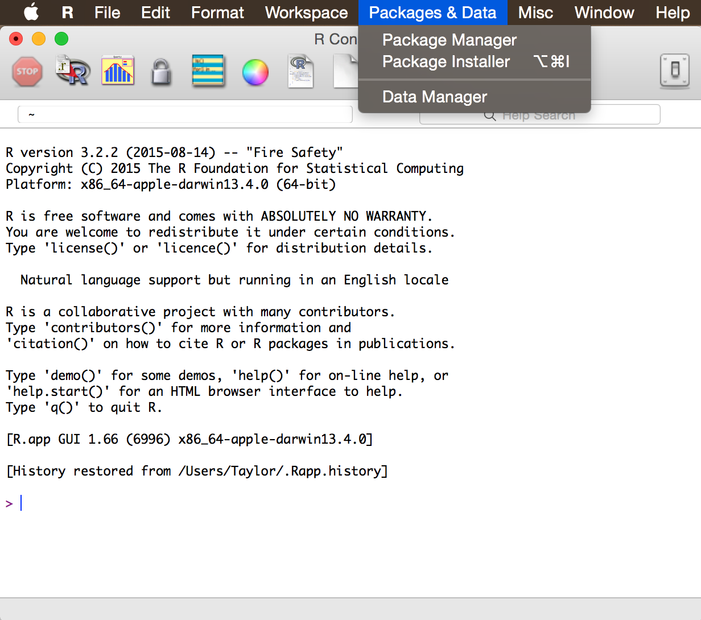
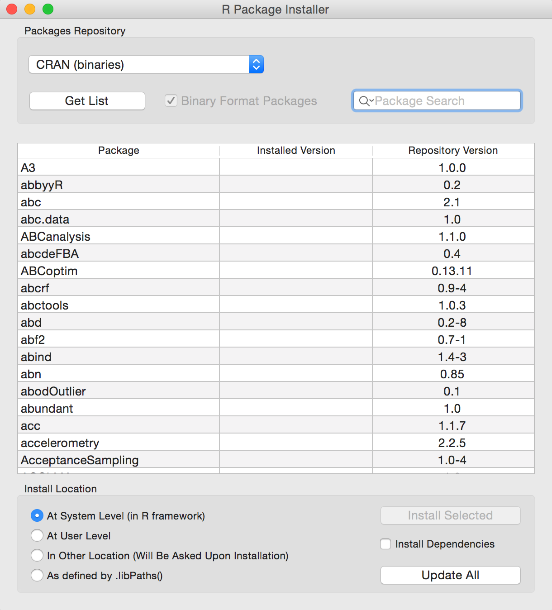
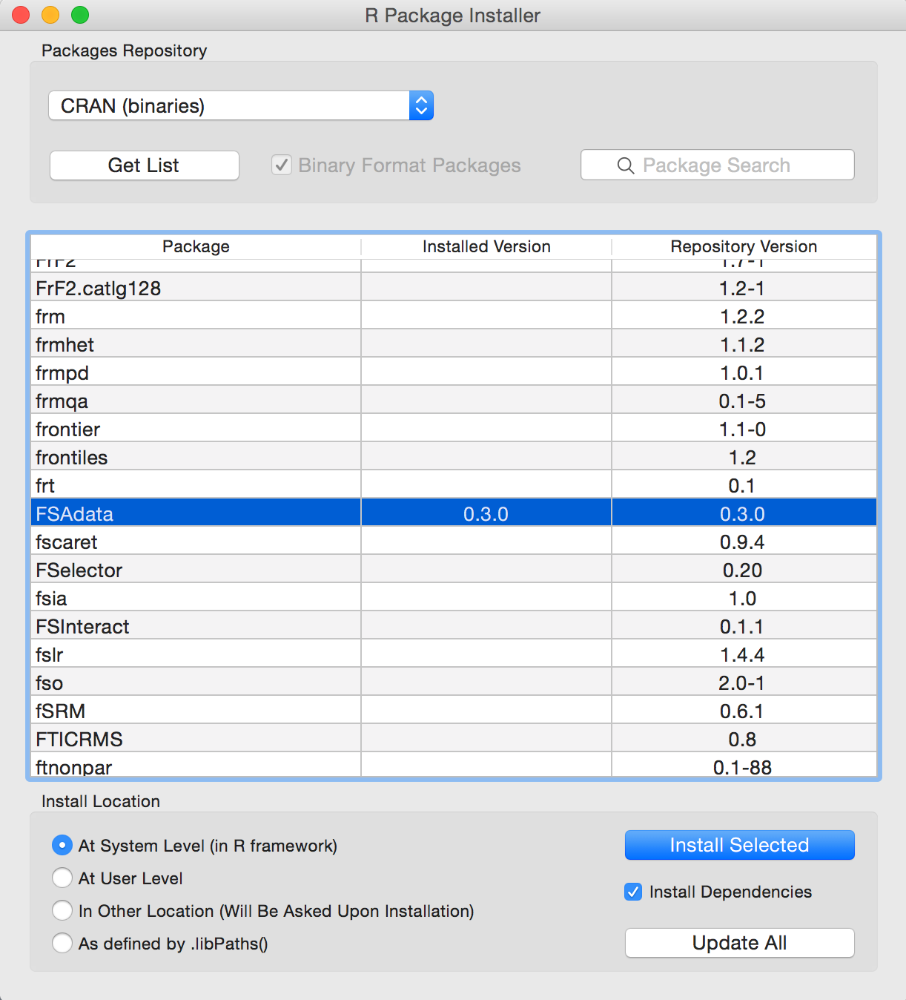

## Installing Packages from CRAN

Packages distributed via the Comprehensive R Archive Network (CRAN) extend the functionality of R.  If you have chosen **NOT** to interact with R through RStudio, then these directions explain how to install package from within R.  If you have chosen to use RStudio, then goto [the directions for installing packages within RStudio](InstallPackagesRStudio).

1. Open R.  (*If R is not installed, then follow these directions to install R for [Mac OS](InstallRMac).*)

1. Select the `Packages & Data` menu and `Packages Installer` submenu item.

    

    
    

1. In the dialog box, click `Get List` to compile a current list of available packages.

    

    
    

1. Select the packages to install (use the `<command>` key to select multiple packages).  Make sure the `Install Dependencies` option is selected.  Click `Install Selected` and R should now install these packages plus all packages that these depend on.  This may take several minutes and you should see a version number in the "Installed Version" column when complete.

    

    
    

----

## Installing FSA and FSAdata

The `FSA` and `FSAdata` packages are distributed on CRAN and can be installed using the directions above.

-----

Thanks to Taylor Stewart for help with these directions.
