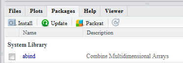

## Installing Packages from CRAN

Packages distributed via the Comprehensive R Archive Network (CRAN) extend the functionality of R.  If you have chosen to interact with R through RStudio, then these directions explain how to install package from within RStudio.  If you have not chosen to use RStudio, then goto the directions for installing packages within R for [Windows](InstallPackagesRWin) or the [Mac]().

1. Open RStudio (if not already open).  Of course, these directions assume that you have installed RStudio.  If not, here are directions to install RStudio for [Windows](InstallRStudioWin) or [Mac]().

1. In the lower-right pane of RStudio, select the `Packages` tab and the `Install` button.

    

    
    

1. Type the name of the packages to be installed in the "Packages (separate multiple packages with a space or comma):" box.  Make sure the "Install dependencies" option is checked.  The example below illustrates installing the `dplyr`, `nnet`, `nlstools`, and `AICcmodavg` packages.

    

    
    

1. Press `Install`.  RStudio should now install these packages plus all packages that these depend on.  This may take several minutes and you should see several "package 'xxx' successfully unpacked and MD5 sums checked" messages.
    * Depending on your priveleges on your machine, you may get a warning at this point about a library that "is not writable" and then be prompted with a dialog box asking you "Would you like to use a personal library instead?"  You can select `Yes` on this dialog box.  A second dialog box will appear with a question that starts with "Would you like to create a personal library."  You can also select `Yes` on this dialog box.

## Installing FSA and FSAdata

The `FSA` and `FSAdata` packages are distributed on CRAN and can be installed using the directions above.
