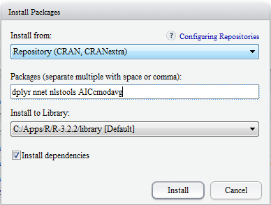
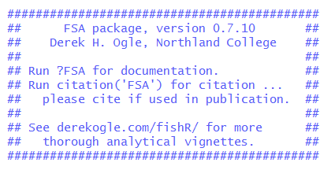
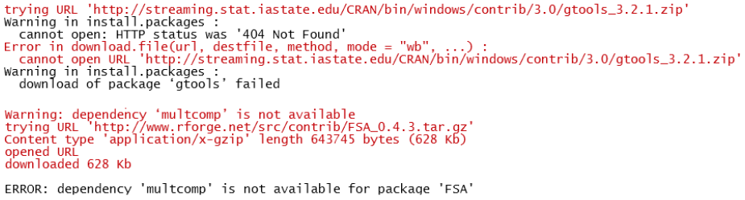

## Installing Packages from CRAN

Packages distributed via the Comprehensive R Archive Network (CRAN) extend the functionality of R.  If you have chosen to interact with R through RStudio, then these directions explain how to install package from within RStudio.  If you have not chosen to use RStudio, then goto the directions for installing packages within R for [Windows](InstallPackagesRWin) or the [Mac]().

1. Open RStudio (if not already open).  Of course, these directions assume that you have installed RStudio.  If not, here are directions to install RStudio for [Windows](InstallRStudioWin) or [Mac]().

1. In the lower-right pane of RStudio, select the `Packages` tab and the `Install` button.

    

    
    

1. Type the name of the packages to be installed in the "Packages (separate multiple packages with a space or comma):" box.  Make sure the "Install dependencies" option is checked.  The example below illustrates installing the `dplyr`, `nnet`, `nlstools`, and `AICcmodavg` packages.

    

    
    

1. Press `Install`.  RStudio should now install these packages plus all packages that these depend on.  This may take several minutes and you should see several "package 'xxx' successfully unpacked and MD5 sums checked" messages.

    * Depending on your priveleges on your machine, you may get a warning at this point about a library that "is not writable" and then be prompted with a dialog box asking you "Would you like to use a personal library instead?"  You can select `Yes` on this dialog box.  A second dialog box will appear with a question that starts with "Would you like to create a personal library."  You can also select `Yes` on this dialog box.

## Installing FSA and FSAdata

The `FSA` and `FSAdata` packages are special purpose packages for fisheries analyses that have not been officially released on CRAN.  These packages are available in GitHub and RForge.net repositories and can be installed following these directions.  *Note that about 10% of installations on Windows machines will result in some sort of error when following these directions.  In these cases, see the directions in the "Troubleshooting the Installation of the FSA Package" section following these directions.

1. Open RStudio (if not already open).

1. Open a new Script pane by selecting the `New` icon to the far left on the RStudio toolbar and choosing `R script` in the ensuing list (alternatively, use the `<CTRL>+<Shift>+N` keystrokes or select the `File+New File+R Script` menu items).  This will open a blank script in the upper-left pane of RStudio (below the toolbar, above the Console pane).

    

    
    

1. In the Script pane, type the following two lines exactly.

    <pre>
    source("http://www.rforge.net/FSA/InstallFSA.R")
    utils::install.packages("FSAdata",repos="http://www.rforge.net/",type="source")
    </pre>

1. Select both lines in the Script pane and press the `Run` button near the far right of the toolbar (alternatively press `<CTRL>+<Enter>`).  This submits these R commands to the Console pane where the `FSA` and `FSAdata` packages and all associated dependencies should be installed.  This may take several minutes with a finish noted by an R prompt (a "greater than") symbol in the Console pane.
    * Depending on your priveleges on your machine, you may get a warning at this point about a library that "is not writable.  See the note in the previous section for how to handle this.
    
1. On separate lines in the Script pane type `library(FSAdata)` and `library(FSA)`.  Highlight both lines and press the `Run` button.  The end of your Console pane should show the following message (the version number may be different).  If you received an error after running `library(FSA)`, then see the next section.

    

    
    

## Troubleshooting the FSA Installation

The `FSA` package is not yet an official R package and, thus, the installation is non-standard.  My experience suggests that about 10% of installations on Windows machines will result in some sort of error that will cause the `FSA` package to not be installed properly.  For example, two typical errors that may be shown in the Console pane after submitting the `source()` line from above are shown below.

The first error above indicates that the `gtools` package was not installed and the second error shows that the `multcomp` package was not installed.

Another typical error is a warning that starts with "unable to move temporary installation" and will include a specific package name.

If these specific errors occurr, then one may need to follow the directions from the first section to manually install the packages mentioned in the errors or warnings (e.g., `gtools` and `multcomp`) and then run the `source()` line again.  This process may take several iterations (`source()`, manually install packages in error) before `FSA` is successfully installed, though, in my experience there are usually only one or two problematic packages.
