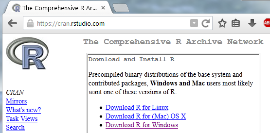
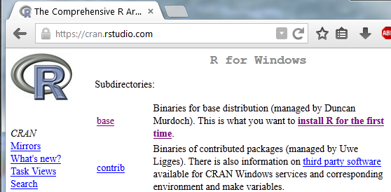
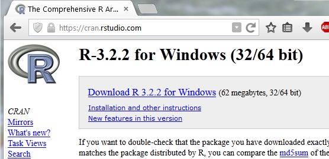
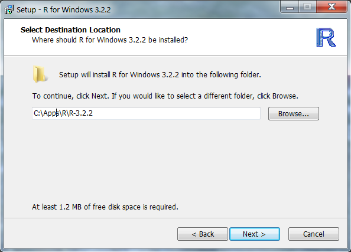
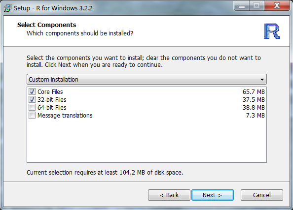
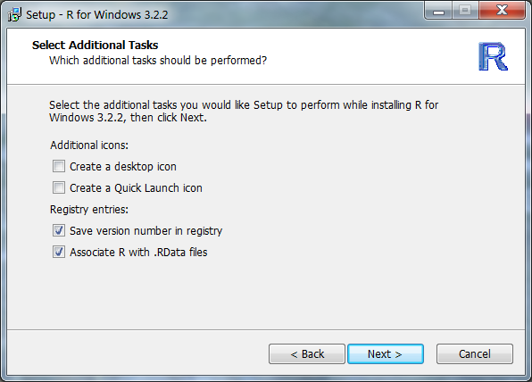

1. Go to the RStudio Comprehensive R Archive Network (CRAN) mirror at [https://cran.rstudio.com](https://cran.rstudio.com).  [You can select a different mirror by going to [http://www.r-project.org](http://www.r-project.org), selecting the "download R" link in the "Getting Started" box and selecting a mirror location from the ensuing page.]

1. Select the appropriate operating system for your computer.  The remainder of these steps will illustrate the installation of R for the WINDOWS environment.

1. Select the "base" option.

1. Select the "Download R 3.2.2 for Windows" option (or similar if the version number has changed).  Either run the program or note where you saved this executable program on your computer.

1. If you did not run the program, then locate the downloaded file on your computer (called "R-3.2.2-win.exe" or similar if the version number has changed) and run it.
1. Select "English" language in the first dialog box (depending on your version of Windows you may have received security warnings before this dialog box appears).
1. Press "Next" on the next two dialog boxes (first, a simple description; second, a user agreement).
1. Select a location to install R (simply use the default location if the location is not important to you -- in the dialog box below I installed in a custom directory).  Press "Next."

1. At this point you can choose to install 32- or 64-bit or both versions of R.  If you do not have a 64-bit computer, then you must install the 32-bit version.  If you do have a 64-bit computer, then I suggest, initially and for simplicity, installing only one version or the other.  I usually install the 32-bit version as it has some slight advantages when not working with extremely large data sets and with other software that I have installed on my machine (see this [R FAQ](http://streaming.stat.iastate.edu/CRAN/bin/windows/base/rw-FAQ.html#Should-I-run-32_002dbit-or-64_002dbit-R_003f).  In this demonstration, I will install only the 32-bit version of R by deselecting the "64-bit Files" option.  Press "Next."

1. Select the "No (accept defaults)" (this is the default) option.  Press "Next."
1. Decide whether to create a shortcut in your Start Menu folder (I suggest NOT).  Press "Next."
1. Decide whether or not to create desktop or Quick Launch icons (top two choices) and whether to register the version number and associate .RData files with R (bottom two choices).  Generally, you will want to register the version number and associate the .RData files with R.  You will not run R directly (rather you will run it through RStudio).  Thus, I would suggest not creating Desktop or Quick Launch Icons.  Press "Next."

1. R should then begin installing files into the directory you chose previously.  If everything goes well, then you should get one last dialog box noting such.  Press "Finish."
