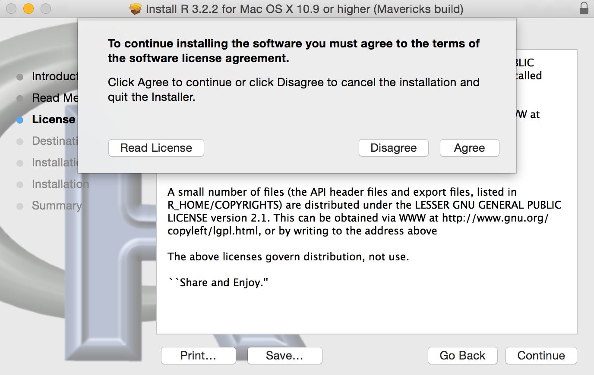
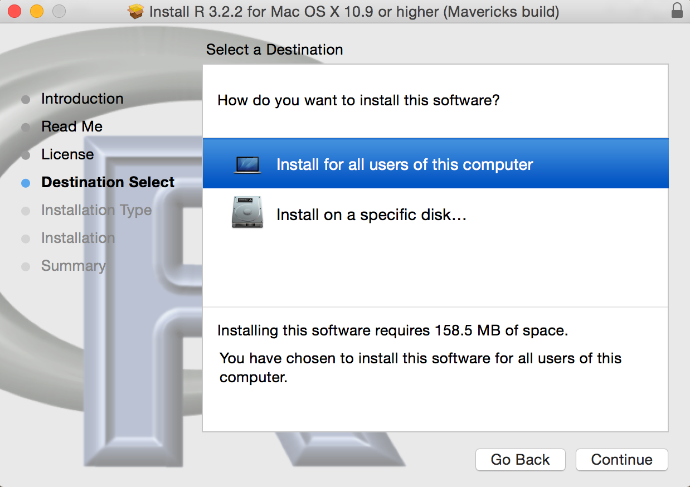

The following steps may be used to install R on a Macintosh operating system.  [See these directions](InstallRWin.html) for installing R on a Windows operating system.

1. Go to the RStudio Comprehensive R Archive Network (CRAN) mirror at [https://cran.rstudio.com](https://cran.rstudio.com).  [*You can select a different mirror by going to [http://www.r-project.org](http://www.r-project.org), selecting the "download R" link in the "Getting Started" box, and selecting a mirror location from the ensuing page.*]

1. Select the "Download R for (Mac) OS X" link.

    

    
    

1. Select the "R-3.2.2.pkg" option (or similar if the version number has changed) if running Mac OS 10.9 (Mavericks) and higher.  (*note that the binary support for OS X before Mavericks is deprecated.*)

    

    
    

1. Locate the downloaded package on your computer (called "R-3.2.2.pkg" or similar if the version number has changed) and run it.

1. Select `Continue` in the first three dialog boxes (first, an installer description; second, a simple software description; third, a user agreement).

1. Select `Agree` to accept the terms of the software license agreement.

    

    
    

1. Select to install R for all users or on a specific disk (simply use the all users option unless you wish to install R on a disk partition or external drive).  Press `Continue`.  (*Note that you must select an option before the `Continue` button will activate.*)

    

    
    

1. Select `Install`.

    

    
    

1. A dialog box will prompt you for the password to your user account.  Input your password and press `Install Software`.

    

    
    

1. R should then begin installing files.  If everything goes well, then you should get one last dialog box noting such.  Press `Close`.

    

    
    

If you plan to use RStudio, then you can now install it [with these directions](InstallRStudioMac.html).

-----

Thanks to Taylor Stewart for help with these directions.
