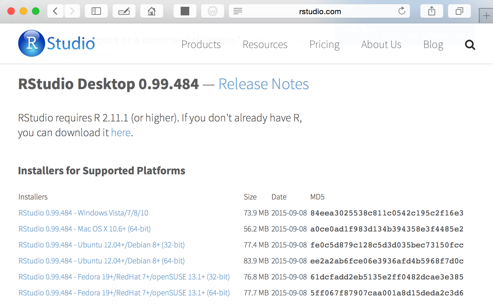
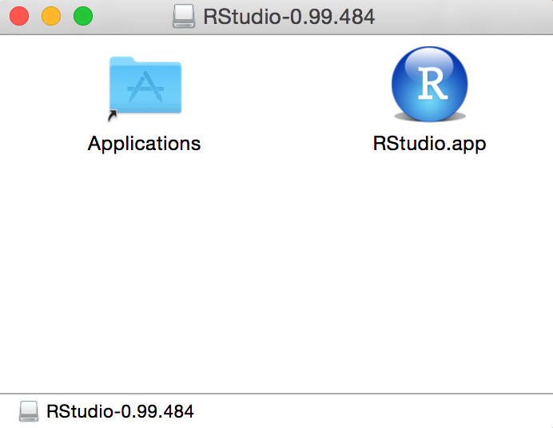
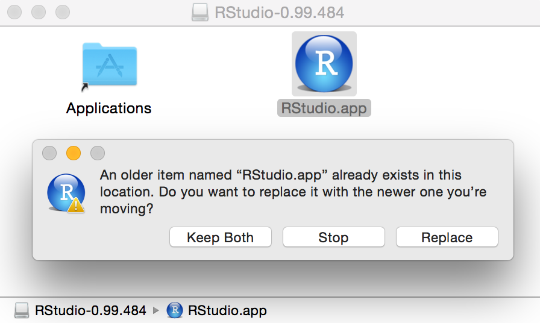
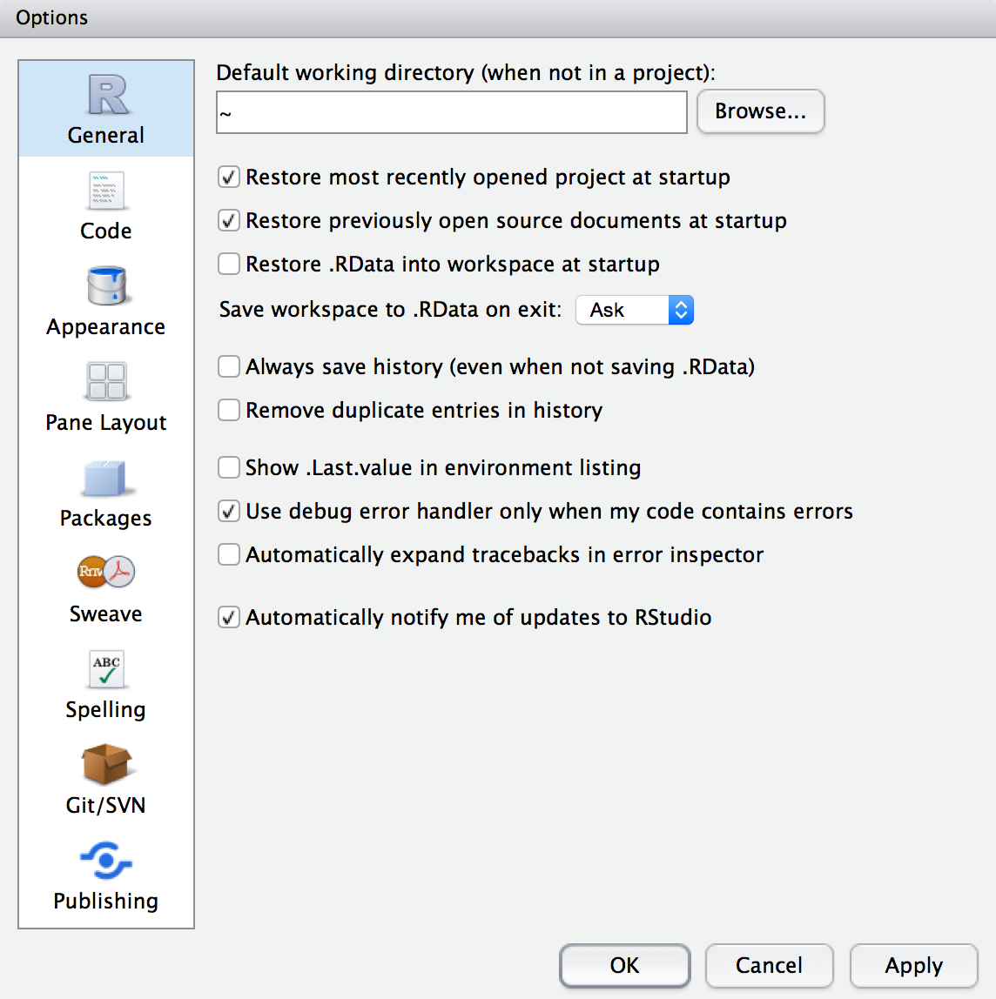
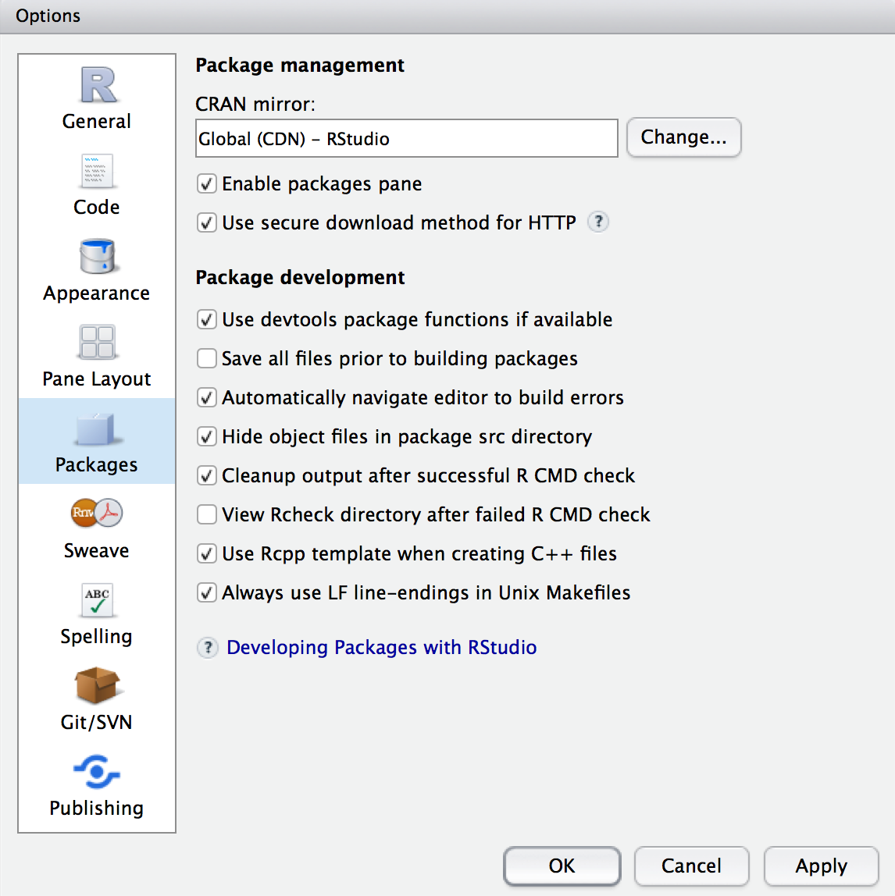
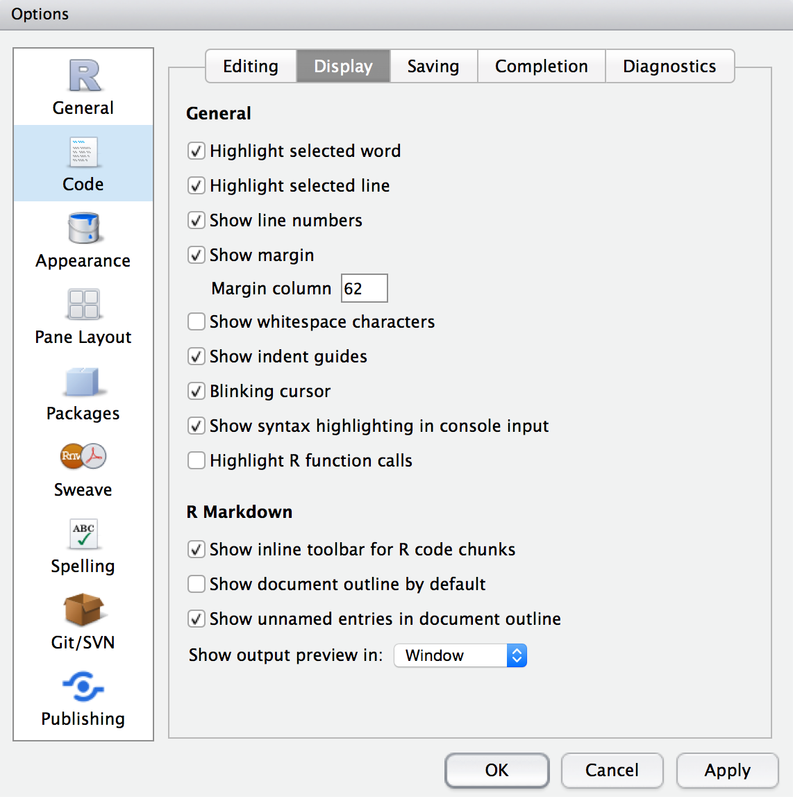
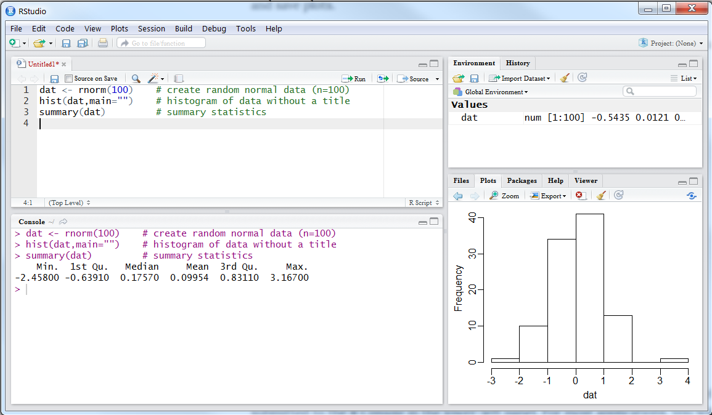
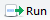

<strong>Jump to:</strong> <a href="#installing-rstudio">Installing</a> / <a href="#configuring-rstudio">Configuring</a> / <a href="#introducing-rstudio">Introducing</a>

----

## What is RStudio?

R is an open-source software environment for statistical computing and graphics that runs on Windows, Mac OS, and many UNIX platforms. Unlike many other programs, users interact with R through a command line rather than through a graphical user interface.   While such an interface may be unfamiliar to many users, its primary strength is the ability for users to develop scripts of commands to perform various analyses that can then be easily repeated.

RStudio is an open-source integrated development environment (IDE) that serves as a front-end "on top" of R. RStudio eases the user's interaction with R by providing some of the conveniences of a GUI and, more importantly, a means for efficiently constructing and running R scripts. Among other conveniences, RStudio provides a four-panel layout that includes a feature-rich source-code editor (includes syntax highlighting, parentheses completion, spell-checking, etc.), a tight link to the R console, a system for examining objects saved in R, an interface to R help, and extended features to examine and save plots.

RStudio is easy to learn. This page has directions for [installing](#installing-rstudio) and [configuring Rstudio](#configuring-rstudio) for use in a Windows operating system and a brief [introduction](#introducing-rstudio) to using RStudio.

------

## Installing RStudio

1. Go to the [RStudio desktop download page](https://www.rstudio.com/products/rstudio/download/#download).

1. Select the link from the "Installers for Supported Platforms" list that corresponds to the operating system appropriate for your computer.

    

    
    

1. Locate and open the downloaded disk image (called "RStudio-0.99.484.dmg" or similar if the version number has changed ... the version is now at least 1.1.383).

    

    
    

1. Drag the RStudio.app icon into the Applications folder. If you are installing RStudio for the first time it will copy the contents into the Applications folder, but if an older version of Rstudio exists, then you will need to select `Replace` to update the contents with the newer version of RStudio.

    

    
    

1. Close the folder and eject disk image.

----

## Configuring RStudio

1. Open RStudio.

1. Select the `Tools` menu and `Global Options` submenu. In the ensuing dialog box select the `General` icon on the left (this should already be selected).

    

    
    

    * You can either leave the other selections at their defaults or change them as you see fit (my preferences are shown in the dialog box above). However, I strongly urge you to deselect "Restore .RData into workspace at startup" and make sure "Save workspace to .RData on exit:" is set to "Never."

1. Select the `Packages` icon in the Global Options dialog box opened above. It is useful to set a CRAN mirror in this dialog box. I prefer the "Global (CDN) - Rstudio ..." option but you may want to choose a location nearer to you (through the `Change...` button). All other options can remain at their defaults.

    

    
    

1. Select the `Code` icon in the Global Options dialog box opened above and the `Display` tab. I suggest, in addition to the default selections, selecting the "Highlight selected line," "Show margin," and "Show syntax highlighting in console input."

    

    
    

1. At times I find the code completion options in RStudio irritating. If you do as well, you can either turn this option off or tweak its settings within the `Completion` tab under the `Code` icon in the Global Options` dialog box opened above.

1. No other options need to be set for most introductory purposes. Press `OK`.

----

## Introducing RStudio

### RStudio Design

RStudio is organized around a four-panel layout.

The upper-left panel is the R *Script Editor*. R commands are typed into this panel and submitted to the R *Console* in the lower-left panel. For most applications, you will type R commands into the *Script Editor* and submit them to the *Console*; you will not type commands directly into the *Console*. The *Script Editor* is a high-level text editor, whereas the *Console* is the R program.

The upper-right panel contains at least two tabs --- *Environment* and *History*. Many items listed under the *Environment* tab can be double-clicked to open them for viewing as a tab in the *Script Editor*. The *History* tab simply shows all of the commands that you have submitted to the *Console* during the current session.

The lower-right panel contains at least five tabs -- *Files*, *Plots*, *Packages*, *Help*, and *Viewer*. The *Plots* tab will show the plots produced by commands submitted to the *Console*. One can cycle through the history of constructed plots with the arrows on the left side of the plot toolbar and plots can be saved to external files using the "Export" tab on the plot toolbar (see figure above). A list of all installed packages is seen by selecting the *Packages* tab (packages can also be installed through this tab as described in a separate document). Help for each package can be obtained by clicking on the name of the package. The help will then appear in the *Help* tab.

### Basic Usage
Your primary interaction with RStudio will be through developing R scripts in the *Script Editor*, submitting those scripts to the *Console*, and viewing textual or tabular results in the *Console* and graphical results in the *Plot* panel. In this section, I briefly introduce how to construct and run R scripts in RStudio.

One opens a blank file for an R script by selecting the `New` icon () and then `R Script`; selecting the `File` menu, `New` submenu, and `R Script` item; or with `<CTRL>+<Shift>+N`. In the newly created *Script Editor* panel, type the three lines exactly as shown below (for the moment, don't worry about what these lines do.).


dat <- rnorm(100)    # create random normal data (n=100)
hist(dat,main="")    # histogram of data without a title
summary(dat)         # summary statistics


These commands must be submitted to the *Console* to perform the requested calculations. Commands may be submitted to the *Console* in a variety of ways:

* Put the cursor on a line in the *Script Editor* and press the `Run` icon (); altenatively press `<CTRL>+<Enter>`). This will submit that line to the *Console* and move the cursor to the next line in the *Script Editor*. Pressing  (or `<CTRL>+<Enter>`) will submit this next line. And so on.

* Select all lines in the *Script Editor* that you wish to submit and press  (or `<CTRL>+<Enter>`).

The RStudio layout after using the first method is shown in the figure above.

The R Script in the *Script Editor* should now be saved by selecting the `File` menu and the `Save` item (alternatively, pressing `<CTRL>+S`). RStudio can now be closed (do NOT save the workspace). When RStudio is restarted later, the script can be reopened (choose the `File` menu and the `Open file ...` submenu if the file is not already in the *Script Editor*) and resubmitted to the *Console* to exactly repeat the analyses. (**Note that the results of commands are not saved in R or RStudio; rather the commands are saved and resubmitted to reperform the analysis.**)

-----

Thanks to Taylor Stewart for help with these directions.
